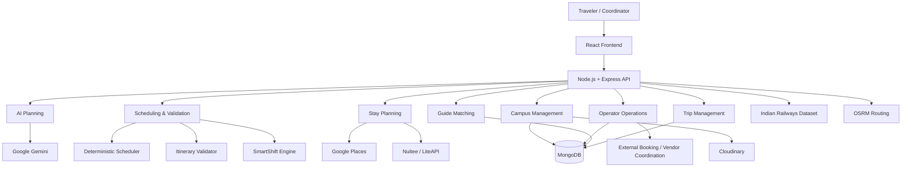

# ✈️ TRANSIX

### From Idea to Experience. One Connected Journey.

**TRANSIX** is an AI-powered, constraint-aware multimodal travel planning and tour-operations platform designed for the Indian travel ecosystem.

It transforms a travel idea into a **personalized, geographically coherent, budget-aware and editable journey**, while connecting itinerary planning with stays, transportation, local experiences, guides, campus trips and operator coordination.

> **Plan Smarter. Travel Better. Adapt Faster.**

---

## 🌍 What is Transix?

Traditional travel planning is fragmented across itinerary planners, hotel platforms, transport services, local guides and spreadsheets. Transix brings these stages together into one connected workflow:

**Idea → Discover → Personalize → Plan → Operate → Adapt → Experience**

The platform combines **Generative AI with deterministic scheduling and validation**, so AI can create the itinerary while rule-based systems verify timing, budget, geography and travel feasibility.

Transix supports both:

* 🧳 **Personal Trips**
* 🎓 **Campus / Industrial Visits**

---

## ✨ Key Features

### 🤖 AI-Powered Itinerary Generation

Generate multi-day travel plans using **Google Gemini**, based on:

* Source and destination
* Travel dates
* Number of travelers
* Budget
* Travel mode
* Hotel preference
* Food preference
* Interests
* Trip type
* Campus/educational requirements

AI-generated plans are subsequently processed through deterministic scheduling and validation rather than being treated as the final source of truth.

---

### 🧠 Deterministic Scheduling & Validation

Transix adds a rule-based intelligence layer on top of AI.

The scheduling engine handles:

* Activity start and end times
* Travel durations
* Transport buffers
* Hotel check-in/check-out
* Meal windows
* Fixed transport events
* Activity sequencing
* Overnight transportation

The validation engine checks:

* 💰 Budget constraints
* ⏱️ Schedule conflicts
* 📍 Geographic consistency
* 🏨 Stay continuity
* 🚆 Transport feasibility
* 🎯 Interest alignment

This creates a **hybrid AI + deterministic planning architecture**.

---

### 🏨 Smart Stay Planning

Transix automatically derives accommodation segments from the itinerary.

It supports:

* Multi-city stays
* Consecutive-night merging
* Check-in/check-out planning
* Overnight travel handling
* Hotel discovery
* Hotel selection
* Accommodation budget calculation
* Stay-plan synchronization after itinerary changes

Hotel information can be sourced through **Google Places**, with rate discovery through supported hotel APIs when available.

---

### 🚆 Multimodal Travel Planning

Transix supports travel planning around:

* 🚆 Trains
* ✈️ Flights
* 🚌 Buses
* 🚕 Cabs / local transportation

The platform includes an Indian railway dataset for train search and schedule-based planning.

For other transportation modes, the current prototype uses available schedule data, routing calculations, estimates and external booking links where direct inventory APIs are unavailable.

> **Important:** Transix does not claim to automatically book every transport service. Booking confirmation can be handled externally by the operator.

---

### 🧩 Interactive Tour Builder

Users can customize their generated journey through an interactive itinerary builder.

They can:

* Add activities
* Remove activities
* Reorder itinerary items
* Drag and drop components
* Modify timing
* Review estimated costs
* Detect conflicts
* Customize individual days

This allows users to move from **AI-generated planning to human-controlled personalization**.

---

### 🔄 Cascade Impact Analysis

When a new activity or change is introduced, Transix can analyze its impact on the existing itinerary.

It can identify:

* Time conflicts
* Scheduling pressure
* Available alternative slots
* Potential itinerary rebalancing

The system does not silently change the user's itinerary.

---

### ⚡ SmartShift

SmartShift is a deterministic disruption-handling engine.

When a flexible activity becomes difficult to accommodate, the system searches for feasible alternative positions while preserving important constraints.

It is designed to handle itinerary adaptation without relying entirely on another AI generation call.

---

### 🧭 Local Experiences & Essentials

Using location-based services, Transix can surface:

* Attractions
* Restaurants
* Cafés
* Hospitals
* ATMs
* Pharmacies
* Police stations
* Other local essentials

This connects itinerary planning with useful destination-level information.

---

### 🧑‍💼 Guide Matching & Guide Portal

Transix includes a dedicated guide workflow.

Guides have profiles containing information such as:

* Geographic knowledge
* Languages
* Availability
* Group-size preference
* Guiding experience
* Professional information
* Verification status

The system geographically matches suitable guides to a trip and allows the operator to send guide requests.

### Guide Workflow

**Trip Requirement → Geographic Matching → Guide Request → Guide Response → Operator Selection → Confirmation**

Guides can:

* View requests
* Accept or reject requests
* Provide availability
* Submit pricing
* Add response notes

Operators can review and select the guide for the trip.

---

### 🎓 Campus / Industrial Visit Management

Transix extends beyond individual travel with a dedicated campus-trip lifecycle.

It supports:

**Create IV → Generate Educational Itinerary → Configure Registration → Share IV Code → Student Registration → Document Submission → Coordinator Monitoring → Operator Coordination**

Campus functionality includes:

* Institution details
* Educational/industrial visit requirements
* Expected participants
* Per-student budget
* Registration settings
* IV join codes
* Student registration
* Document uploads
* Coordinator dashboard
* Participant dashboard
* Announcements
* Payment/status tracking
* Group travel planning

---

### 🧑‍💼 Tour Operation Center

After itinerary finalization, Transix moves from **planning to operations**.

The Operator portal allows operators to:

* View finalized trips
* Review booking requirements
* Coordinate accommodation
* Coordinate transportation
* Manage vendor-related requirements
* Record external booking references
* Track booking status
* Manage guide arrangements

The operator workflow is intentionally designed around **human coordination where direct third-party booking APIs are unavailable**.

---

## 🏗️ System Architecture



---

## 🔄 How Transix Works

### 1. Collect

The user provides travel requirements such as:

**Destination + Dates + Budget + Travelers + Interests + Travel Mode + Stay Preference**

### 2. Generate

Gemini generates a structured multi-day itinerary based on those constraints.

### 3. Validate

The deterministic layer checks:

**Time + Geography + Budget + Stay + Transport + Interests**

### 4. Build

The user can modify the itinerary through the interactive Tour Builder.

### 5. Discover

Hotels, trains, attractions, restaurants and local services can be explored through integrated data sources.

### 6. Coordinate

Finalized trips generate operational booking requirements for the operator.

### 7. Adapt

Changes and disruptions can be analyzed using Cascade Impact Analysis and SmartShift.

### 8. Experience

The result is a connected journey spanning planning, personalization and operational coordination.

---

## 🛠️ Technology Stack

### Frontend

* **React 19**
* **Vite**
* **Tailwind CSS v4**
* **React Router**
* **Framer Motion**
* **React Leaflet**
* **Lucide React**
* **React Icons**
* **Axios**
* **React Hot Toast**
* **jsPDF**

### Backend

* **Node.js**
* **Express 5**
* **MongoDB**
* **Mongoose 9**
* **JWT Authentication**
* **Zod**
* **Multer**
* **Cloudinary**

### AI & Intelligence

* **Google Gemini**
* Deterministic itinerary scheduler
* Constraint validation engine
* Stay-plan synchronization
* Cascade Impact Analysis
* SmartShift rescheduling
* Geographic guide matching

### External Services & Data

* **Google Places API**
* **Nuitee / LiteAPI**
* **OSRM**
* **Indian Railways schedule dataset**
* **Cloudinary**
* External travel/booking links

---

## 📂 Project Structure

```text
Transix/
│
├── frontend/
│   ├── src/
│   │   ├── components/
│   │   ├── pages/
│   │   ├── contexts/
│   │   ├── services/
│   │   └── ...
│   ├── package.json
│   └── vite.config.js
│
├── backend/
│   ├── src/
│   │   ├── controllers/
│   │   ├── models/
│   │   ├── routes/
│   │   ├── services/
│   │   ├── middleware/
│   │   ├── validators/
│   │   ├── utils/
│   │   ├── import/
│   │   └── tests/
│   │
│   ├── server.js
│   ├── package.json
│   └── .env.example
│
├── data/
│   ├── Indian Cities Database.csv
│   └── flight-schedules/
│
├── TRANSIX_FEATURE_REPORT.md
└── README.md
```

---

## 🚀 Getting Started

### Prerequisites

Make sure you have:

* Node.js
* npm
* MongoDB / MongoDB Atlas
* Required API credentials

---

### 1. Clone the Repository

```bash
git clone https://github.com/Afifa-118114/Transix.git
cd Transix
```

---

### 2. Setup Backend

```bash
cd backend
npm install
```

Create a `.env` file based on `.env.example`.

Example:

```env
MONGO_URI=your_mongodb_connection_string
PORT=5000

JWT_SECRET=your_jwt_secret
GEMINI_API_KEY=your_gemini_api_key

GOOGLE_PLACES_API_KEY=your_google_places_api_key

NUITEE_API_KEY=your_nuitee_api_key

CLOUDINARY_CLOUD_NAME=your_cloudinary_cloud_name
CLOUDINARY_API_KEY=your_cloudinary_api_key
CLOUDINARY_API_SECRET=your_cloudinary_api_secret

RAZORPAY_KEY_ID=your_razorpay_key_id
RAZORPAY_KEY_SECRET=your_razorpay_key_secret

GOOGLE_CLIENT_ID=your_google_client_id
```

Start the backend:

```bash
npm run dev
```

The backend runs on:

```text
http://localhost:5000
```

---

### 3. Setup Frontend

Open another terminal:

```bash
cd frontend
npm install
npm run dev
```

Vite will provide the local development URL, typically:

```text
http://localhost:5173
```

---

## 🔐 Environment Variables

Never commit real API keys, passwords or secrets to GitHub.

The project provides:

```text
backend/.env.example
```

Use it as the template for your local `.env` file.

---

## 👥 User Roles

### Traveler

Plans and customizes personal journeys.

### Operator

Coordinates finalized trips, booking requirements, vendors and guides.

### Admin

Provides administrative access to protected platform functionality.

### Campus Coordinator

Manages an individual campus/industrial visit as the trip coordinator.

### Campus Participant

Registers and manages participation in a campus trip.

### Guide

Uses the dedicated guide portal to receive and respond to trip requests.

---

## 🗃️ Core Data Models

Transix uses MongoDB/Mongoose models including:

* `User`
* `Trip`
* `CampusRegistration`
* `BookingRequirement`
* `Train`
* `FlightSchedule`
* `GuideProfile`
* `GuideRequest`
* `Vendor`
* `VendorRequest`
* `VendorAccount`
* `Notification`
* `TripMessage`
* `Location`

The `Trip` model acts as the central journey record connecting itinerary, stay, transport, campus configuration and operational requirements.

---

## 🧪 Testing

The backend contains dedicated tests for important planning and guide workflows.

Example:

```bash
cd backend
npm run test:guide-matching
```

Additional test and verification scripts are available under:

```text
backend/src/tests/
backend/test_*.js
backend/verify*.js
```

---

## 📊 Implementation Status

| Module                      | Status        |
| ---------------------------- | ------------- |
| AI Itinerary Generation     | ✅ Implemented |
| Deterministic Scheduling    | ✅ Implemented |
| Itinerary Validation        | ✅ Implemented |
| Stay Planning               | ✅ Implemented |
| Interactive Tour Builder    | ✅ Implemented |
| SmartShift                  | ✅ Implemented |
| Local Experiences           | ✅ Implemented |
| Food & Essentials           | ✅ Implemented |
| Train Planning              | ✅ Implemented |
| Hotel Discovery             | 🟡 Partial    |
| Flight / Bus / Cab Planning | 🟡 Partial    |
| Guide Matching & Portal     | ✅ Implemented |
| Tour Operation Center       | 🟡 Partial    |
| Campus Trip Lifecycle       | ✅ Implemented |
| Campus Document Management  | 🟡 Partial    |
| Campus Payments             | 🟠 Prototype  |
| Post-Trip Expense Analysis  | ⚪ Planned     |
| Travel DNA                  | 🟠 Prototype  |

---

## ⚠️ Current Prototype Limitations

Transix is an actively developed project and some modules are intentionally prototype-level.

### Transportation

Train planning is backed by the project's Indian Railways dataset. Flight, bus and cab functionality currently uses available schedule data, routing calculations, estimates and/or external links rather than universal live inventory.

### Hotel Booking

Hotel discovery and rate information can be integrated through external services, but Transix does not perform universal on-platform hotel checkout.

### Operator Booking

Operators coordinate actual bookings and confirmations externally where direct vendor APIs are unavailable.

### Campus Payments

Campus payment processing is currently simulated for the prototype and is not a production payment gateway.

### Campus Documents

Document upload/storage is implemented through Cloudinary, while some coordinator-side document preview/approval flows remain under refinement.

### Post-Trip Analysis

Actual expense tracking, receipt-based expense logging and estimated-vs-actual post-trip analysis are planned but not currently part of the implemented core workflow.

---

## 🔒 Privacy & Security

Transix uses:

* JWT-based authentication
* Role-based route protection
* Environment variables for secrets
* Password hashing
* Protected API routes
* Cloudinary for uploaded documents
* Restricted guide document projections

Sensitive credentials and API keys should always remain outside the repository.

---

## 🎯 Why Transix?

Transix is designed around a simple idea:

> **Travel planning should not end when the itinerary is generated.**

Instead, the journey should move continuously from:

**Planning → Personalization → Validation → Selection → Coordination → Adaptation**

By combining **Generative AI, deterministic algorithms, real data sources and human operational workflows**, Transix aims to bridge the gap between an AI-generated itinerary and an actually manageable travel experience.

---

## 🌐 Live Demo

**Transix:**
https://transix-henna.vercel.app

**GitHub Repository:**
https://github.com/Afifa-118114/Transix

---

## 🏆 Project Context

Transix was developed as a solution for:

**PS-7 — Personalized Dynamic Tour Planning & Tour Operations Platform**

The project focuses on building a unified travel-planning and tour-operations workflow capable of supporting both individual travelers and organized group/campus journeys.

---

## 🔮 Future Scope

Potential future improvements include:

* Real-time flight and bus inventory APIs
* Direct hotel booking integration
* Production payment gateway
* Live disruption feeds
* Institutional group accommodation pricing
* Post-trip expense analysis
* Receipt-based expense tracking
* More advanced traveler preference modeling
* Expanded vendor integrations
* Production-grade guide verification
* Real-time booking synchronization

---

## 👩‍💻 Development

Built with ❤️ using **React, Node.js, MongoDB and Google Gemini**.

### Project Repository

[Afifa-118114/Transix on GitHub](https://github.com/Afifa-118114/Transix)

### Live Application

[Open Transix Demo](https://transix-henna.vercel.app)

---

## 📄 License

This project currently does not specify an open-source license.

If you intend to allow reuse, modification or redistribution of the code, add an appropriate `LICENSE` file to the repository.
