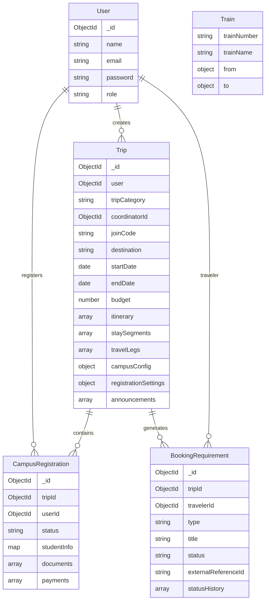

# TRANSIX — Current Feature & Implementation Report

**Branch Checked Out:** `campus-trip`  
**Audit Type:** Codebase Implementation Audit (Ground-Truth Inspection)  
**Scope:** Frontend (React/Vite), Backend (Node/Express), Database Models (Mongoose/MongoDB), External Integrations, Operational & Educational Workflows.

---

## 1. Project Overview

### What Transix Is
Transix is an AI-powered, constraint-aware multimodal travel planning and group trip management platform designed for the Indian travel ecosystem. It bridges the gap between generative AI itinerary drafting, deterministic scheduling/validation, accommodation/transit discovery, and operational coordination.

### Main Purpose
- **Personal Trips:** Enable individual travelers, couples, families, and friend groups to generate budget-bounded, geographically coherent, multi-day itineraries with integrated train schedules, hotel options, and conflict detection.
- **Campus Trips / Industrial Visits (IV):** Provide university faculty and student coordinators with a dedicated group lifecycle management system—from multi-destination educational itinerary generation and IV code sharing, to dynamic student registration forms, document verification (Aadhaar, College ID, Consent), and installment tracking.
- **Operator Portal:** Enable travel operators to view finalized client itineraries, track accommodation/transportation booking requirements, and coordinate booking confirmations without fully automated third-party OTA booking execution.

### Core Architecture & Tech Stack
- **Frontend:** React 19, Vite, TailwindCSS v4, Framer Motion, React Leaflet (OpenStreetMap), React Icons, React Hot Toast, Axios.
- **Backend:** Node.js, Express 5, MongoDB / Mongoose 9, Multer, Cloudinary, Axios, Zod.
- **AI & External Services:** Google Generative AI SDK (`gemini-3.6-flash`), Google Places API (New v1), Nuitee / LiteAPI v3 (Hotel Rates), OSRM (Open Source Routing Machine), Indian Railways station & schedule MongoDB dataset.
- **Major User Types:** Traveler, Operator, Admin (with contextual trip roles: Campus Coordinator and Campus Participant).
- **Major Trip Categories:** `PERSONAL` and `CAMPUS`.

---

## 2. Feature Status Summary

| Feature | Category | Status | Current Maturity |
|---|---|---|---|
| **Conversational Trip Creation Form** | Personal Trip | ✅ Implemented | High efficiency; validates conversational inputs, calculates dates, and maps to strict backend enums. |
| **Gemini AI Itinerary Generation** | Personal Trip | ✅ Implemented | Reliable with retry loop; incorporates real train data and multi-location stay derivation using `gemini-3.6-flash`. |
| **Deterministic Timeline Scheduler** | Personal Trip | ✅ Implemented | Highly deterministic and robust; eliminates overlaps, enforces meal/activity windows, and adds transit buffers. |
| **Itinerary Validator Engine** | Personal Trip | ✅ Implemented | Strong rule-based validation checking budgets, stay continuity, interest match, and transit night offsets. |
| **Stay Plan & Multi-City Segments** | Personal Trip | ✅ Implemented | Solid architectural core; auto-derives segments, merges consecutive nights, and resyncs dirty days via AI. |
| **Hotel Discovery & Rates** | Personal Trip | 🟡 Partially Implemented | Dual-source (Google Places + Nuitee API); live pricing works when Nuitee matches, but lacks automated room checkout. |
| **Travel Options & Train Planner** | Personal Trip | 🟡 Partially Implemented | Trains use real MongoDB Indian Railways dataset; Flights, Buses, and Cabs are formulaic estimates with external URLs. |
| **Tour Builder (Canvas)** | Personal Trip | ✅ Implemented | Functional 3-column builder; supports drag/drop, item reordering, custom additions, and conflict checking. |
| **Cascade Impact Engine** | Personal Trip | 🟡 Partially Implemented | Analyzes insertion conflicts and proposes free slots or rebalances; does not dynamically listen to live vendor delays. |
| **SmartShift Engine** | Personal Trip | ✅ Implemented | Fully working deterministic rescheduling engine; moves disrupted items to safe gaps with budget/count invariant guards. |
| **Travel DNA** | Personal Trip | 🟠 Prototype / Demo-level | Cosmetic only; renders a hardcoded or rating-scaled match percentage badge without any user persona vector model. |
| **Local Experiences & Attractions** | Personal Trip | ✅ Implemented | Backed by Google Places API; fetches verified local attractions, photos, and ratings for destinations. |
| **Food & Essentials Directory** | Personal Trip | ✅ Implemented | Google Places-backed directory for restaurants, cafes, hospitals, ATMs, pharmacies, and police stations. |
| **Pre-Trip Budget Engine** | Personal Trip | ✅ Implemented | Real-time category-wise breakdown (Stay, Travel, Activities, Food); validates total against user budget limits. |
| **Post-Trip Expense Analysis** | Personal Trip | ⚪ Planned / Not Implemented | No models, controllers, or UI exist for post-trip expense logging, receipt scanning, or actual vs. estimated variance. |
| **Trip Finalization & Consent** | Personal Trip | ✅ Implemented | Gated finalization checklist; locks itinerary, triggers booking requirements, and grants operator access. |
| **Operator Dashboard & Booking Mgmt** | Operator | 🟡 Partially Implemented | Functional coordinator interface for tracking requirements and entering PNRs; no automated vendor API execution. |
| **Campus Trip Creation Wizard** | Campus Trip | ✅ Implemented | 4-step wizard capturing org details, educational visits, student budget, and meal/transport inclusions. |
| **Campus Coordinator Dashboard** | Campus Trip | ✅ Implemented | Comprehensive dashboard with registration stats, announcement center, IV code sharing, and student review. |
| **Campus Registration Config** | Campus Trip | 🟡 Partially Implemented | Dynamic form fields and document config fully work; installment plan editing UI is missing from the settings modal. |
| **Campus Participant Dashboard** | Campus Trip | 🟡 Partially Implemented | Complete 3-step registration flow; student details and mock payment work, but document PDF preview has stream/auth bugs. |
| **Campus Document Upload System** | Campus Trip | 🟡 Partially Implemented | Multer-Cloudinary pipeline uploads files reliably; coordinator approval buttons in modal lack click handlers. |
| **Campus Payment System** | Campus Trip | 🟠 Prototype / Demo-level | Simulated mock payment only; sets status to PAID and generates a mock transaction ID without a real payment gateway. |
| **Campus Group Budget & Inclusions** | Campus Trip | 🟡 Partially Implemented | Distinguishes group budget (`budgetPerStudent * participants`) and inclusions toggles; accommodation uses standard room rates. |
| **Saved Trips Hub** | Navigation / Storage | ✅ Implemented | Segregates Personal Trips and Campus IVs; contextually routes users based on Coordinator vs Participant relationship. |
| **Authentication & Route Guards** | Security | ✅ Implemented | JWT auth with role verification (`traveler`, `operator`, `admin`); campus relationships resolved contextually per trip. |

---

## 3. Personal Trip

### 3.1 Trip Creation
- **Feature:** Conversational multi-step intake wizard (`TripForm.jsx`).
- **What it does:** Collects source, destination, dates, budget, traveler count, travel mode, hotel tier, food preferences, group dynamics, and interests.
- **How it works:** Implements a conversational UI with suggestion chips, input validation, and conversational correction (e.g., detecting discrepancies like selecting "Just me" but specifying 4 travelers). Upon submission, it parses colloquial inputs into strict backend enum structures via Zod-compatible schemas.
- **Persistence:** Submits to `POST /api/trips` (or `POST /api/ai/generate`), creating a MongoDB `Trip` record with status `"Generated"`, saves to `localStorage` under `currentTrip`, and synchronizes across open tabs via custom DOM window events.
- **Current status:** ✅ Implemented.
- **Current maturity:** *Strong for current prototype stage.* Reliable parsing, intelligent fallbacks, and multi-tab synchronization make the input lifecycle very stable.

### 3.2 AI Itinerary Generation
- **Feature:** Gemini-powered itinerary synthesis (`aiService.js`).
- **Gemini Integration & Model:** Integrated via `@google/generative-ai` using model **`gemini-3.6-flash`**.
- **Prompt Construction:** Injects source, destination, dates, calculated duration, travelers, budget, interests, and real transit options (pre-queried from the Indian Railways dataset or transit estimators). Enforces strict JSON output schema without markdown fences.
- **Validation & Correction Loop:** After receiving Gemini's JSON output, the backend runs `buildDeterministicTimeline` and `validateItinerary`. If validation fails (e.g., cost exceeds budget, impossible travel timings, or interest mismatch), the system loops up to **3 attempts**, feeding the exact validation errors back into the Gemini prompt for self-correction.
- **Fallbacks & Error Handling:** Handles Google 503 overload errors with exponential retry delays. If all 3 attempts fail, returns a graceful error payload rather than crashing.
- **Current status:** ✅ Implemented.
- **Current maturity:** *Deterministic and reliable for supported scenarios.* The prompt structure and self-correcting feedback loop ensure valid structured itineraries in most standard scenarios.

### 3.3 Deterministic Scheduler
- **Feature:** Post-AI timeline builder (`buildDeterministicTimeline` in `aiService.js`).
- **What it schedules:** Assigns exact start times, end times, and transitions for every activity and travel leg across all days.
- **How timing/order is handled:**
  - Base timeline begins at 08:00 AM daily (`8 * 60` minutes).
  - Categorizes items into fixed immutable events (trains, flights, hotel check-ins) vs flexible activities.
  - Places fixed travel legs as anchor points.
  - Auto-adjusts meals to realistic time windows: Breakfast (07:00 AM–10:00 AM), Lunch (12:00 PM–03:00 PM), Dinner (07:00 PM–11:00 PM).
  - Enforces mandatory transition buffers: 30 minutes post-arrival for transport, 10 minutes between consecutive activities.
  - Caps standard activities at 11:00 PM to prevent spilling past midnight.
- **Why used after AI:** LLMs frequently hallucinate conflicting times (e.g., scheduling a 2-hour museum tour during a train journey or scheduling lunch at 5:00 PM). The deterministic scheduler enforces physical laws on top of AI creativity.
- **Current status:** ✅ Implemented.
- **Current maturity:** *Deterministic and reliable for supported scenarios.* Completely eliminates overlapping time blocks for standard trips.

### 3.4 Itinerary Validator
- **Feature:** Multi-constraint validation engine (`itineraryValidator.js`).
- **What it checks:**
  1. *Budget Validation:* Aggregates estimated costs and flags errors if `totalCost > userBudget`.
  2. *Stay Plan Continuity:* Ensures check-in and check-out dates are contiguous, nights match date math, and first/last stays align with trip start/end.
  3. *Transit Nights:* Automatically discounts overnight transit (cross-midnight journeys) from required hotel stay nights.
  4. *Interest Alignment:* Validates that at least one generated activity matches user-selected interests.
  5. *Geographic Consistency:* Flags warnings if an activity's city/place does not match the active stay segment without an intervening travel leg.
  6. *Schedule Overlaps:* Detects minute-level overlaps between consecutive items.
- **Current status:** ✅ Implemented.
- **Current maturity:** *Functional core with limited edge-case handling.* Handles standard dates and linear trips accurately, though complex island or circuit journeys can produce false-positive location consistency warnings.

### 3.5 Stay Plan
- **Feature:** Multi-destination geographic overnight manager (`StayPlanPage.jsx` & `aiService.js`).
- **Geographic Overnight Segments:** Derives geographic stay points by scanning itinerary locations and activity places per night.
- **Consecutive Night Merging:** If Day 1 and Day 2 activities are in Jaipur, it merges them into a single 2-night stay segment (`nights: 2`) rather than two separate 1-night stays.
- **Non-Consecutive Return Locations:** If a user visits Jaipur, goes to Pushkar, and returns to Jaipur, the engine creates distinct stay segments preserving the chronological circuit.
- **Overnight Transport Accounting:** Detects travel legs crossing midnight and reduces `expectedTripNights` accordingly so the user is not forced to book unnecessary hotel nights.
- **Itinerary Synchronization (`syncItineraryWithStayPlan`):** When a user edits destinations or nights in the Stay Plan, the backend marks only the affected days as "dirty", re-prompts Gemini to generate activities *only* for the modified days, stitches unchanged days back in, injects check-in/check-out events, and re-runs deterministic scheduling.
- **Limitations:** If an edited destination is not recognized by Google Places or is ambiguous, the sync can fail or default to generic activities.
- **Current status:** ✅ Implemented.
- **Current maturity:** *Strong for current prototype stage.* State management between local draft edits, date recalculations, and backend AI synchronization is implemented with high architectural discipline.

### 3.6 Stay / Accommodation
- **Feature:** Hotel discovery, selection, and budget attribution (`HotelDetails.jsx`, `nuiteeService.js`, `placesService.js`).
- **Hotel Selection & Segments:** Users select specific hotels per stay segment. Selecting a hotel attaches its name, nightly price, rating, photos, and coordinates to the segment.
- **Data Sources:** Hybrid model:
  1. Google Places API (New) fetches real hotel names, addresses, ratings, and media photos.
  2. Nuitee / LiteAPI v3 attempts live pricing and room availability lookups based on check-in/check-out dates.
- **Budget Interaction:** Attaching a hotel immediately recalculates the trip's accommodation spend in `budgetStats` and highlights budget surplus/deficits.
- **Persistence:** Stored directly inside `trip.staySegments[].selectedHotel`. Finalizing creates corresponding `BookingRequirement` records.
- **Real vs External:** Hotel rates are fetched from real APIs; however, actual room booking is NOT executed on-platform (external redirect/manual operator booking model).
- **Current status:** 🟡 Partially Implemented.
- **Current maturity:** *Functional UI but limited real-world integration.* Hotel discovery and live rate matching function well, but booking remains external.

### 3.7 Travel Options
- **Feature:** Multi-modal transit finder (`TravelOptionsPage.jsx`, `stationService.js`, `trainPlannerService.js`, `travelService.js`).
- **Trains (Real Data):** Backed by an indexed MongoDB dataset of Indian Railways trains and stations. Resolves station aliases (e.g., "Bombay" → `CSMT`, `BCT`, `BDTS`; "Delhi" → `NDLS`, `DLI`, `NZM`) and searches direct train routes with departure/arrival times, durations, and estimated fares.
- **Flights, Buses, Cabs:** Handled by `travelService.js`. Calculates road distance via OSRM, applies mathematical duration/fare formulas (e.g., `distance / 700 + 1` for flight duration; `₹80 + distance * 14` for cab fare), and generates external links to IRCTC, MakeMyTrip, RedBus, and Uber.
- **Limitations:** Only Trains use a verified schedule dataset. Flights, buses, and cabs do not query live airline or GDS APIs. On the frontend (`TravelOptionsPage.jsx`), selecting Flight or Bus tabs does not load flight/bus lists; only trains are rendered in the list.
- **Current status:** 🟡 Partially Implemented.
- **Current maturity:** *Strong dataset implementation for Trains; prototype formulas for other transit modes.*

### 3.8 Builder
- **Feature:** Interactive itinerary canvas (`TourBuilder.jsx`, `TripBuilderContext.jsx`).
- **Core Components:**
  - `AvailableOptionsPanel`: Categorized inventory of activities, hotels, and transit for the destination.
  - `ItineraryBoard`: Day tabs, drag-and-drop / click-to-add timeline cards, timing adjustment inputs, and activity deletion.
  - `TripSummaryPanel`: Live budget burn-down, activity density meters, feasibility status, and Finalize trigger.
- **Conflict Handling:** When an activity is added or times are adjusted, `detectConflicts` executes immediately. If a clash occurs, `ConflictResolutionModal` opens, proposing alternative slots.
- **Persistence & Finalization:** Live state synced to `localStorage` and persisted via `PUT /api/trips/:id`.
- **Current status:** ✅ Implemented.
- **Current maturity:** *Functional core with limited edge-case handling.* The builder provides a fluid editing experience with real-time constraint feedback.

### 3.9 Cascade Impact Engine
- **Feature:** Insertion conflict analysis and timeline rebalancing (`schedulingEngine.js`, `alternativeEngine.js`, `ConflictResolutionModal.jsx`).
- **Why it exists:** Prevents schedule corruption when travelers add activities into tightly packed days or modify departure times.
- **How it works:**
  - Intercepts item insertions or timing shifts.
  - Detects overlaps with existing activities, pre-departure buffers (60 min), post-arrival buffers (60 min), and hotel check-in/out windows.
  - Evaluates two strategies:
    1. `FREE_SLOT`: Searches the current or subsequent days for an unoccupied gap that fits the activity.
    2. `REBALANCE`: Identifies non-transport, flexible activities (>60 min duration) and proposes shrinking them (by up to 50%) to make room.
- **Important Implementation Truth:** The Cascade Impact Engine **does NOT mutate the itinerary automatically in the background without consent**. It computes candidate alternative trips in memory and presents them via `ConflictResolutionModal`. Only when the user explicitly clicks "Apply" or "Apply Change" is the chosen candidate applied to the trip state.
- **Missing Information Behavior:** If an activity lacks explicit start/end times, default durations (90–120 min) are assumed. If dates are unparseable, day-relative minutes are used.
- **Current status:** 🟡 Partially Implemented.
- **Current maturity:** *Functional UI and client-side analysis engine, but disconnected from external operator disruption feeds.*

### 3.10 SmartShift
- **Feature:** Autonomous single-activity disruption rescheduling (`smartshiftService.js`, `SmartShiftModal.jsx`).
- **Inputs & Workflow:** Triggered via the "Simulate Disruption" button on any non-mandatory timeline card. Takes `tripId` and `itemId`.
- **Algorithm & Execution:**
  1. Locates the affected item in the MongoDB trip document.
  2. Verifies the item is not immutable transit or hotel check-in (which require manual intervention).
  3. Scans for viable empty time slots on the same day or next day respecting a 30-minute travel buffer.
  4. Clones the itinerary, inserts the item into the candidate slot, sorts chronologically, and executes `validateItinerary`.
  5. Returns up to 3 valid, verified alternatives to the frontend modal.
- **Itinerary Mutation:** When the user clicks "Apply this change", `POST /api/trips/:id/smartshift/apply` executes. It verifies document freshness (`_tripUpdatedAt`), enforces strict data integrity guards (asserting that total activity cost and count remain identical before and after the shift), re-runs full itinerary validation, updates `trip.itinerary`, and saves directly to MongoDB.
- **Is AI Involved:** **NO.** SmartShift is 100% deterministic rule-based time-slot optimization.
- **Current status:** ✅ Implemented.
- **Current maturity:** *Deterministic and reliable for supported scenarios.* Features robust data and budget integrity guards.

### 3.11 Travel DNA
- **Feature:** Persona and preference matching indicator.
- **Code Inspection Reality:** There is **NO** machine learning model, vector embedding, or traveler profiling questionnaire implemented. In code (`tourBuilderHelper.js`, `formatTrip.js`, `inventoryService.js`), `dnaMatch` is simply a static integer (e.g., `94`) or mathematically scaled from Google ratings (`rating * 20`).
- **Current status:** 🟠 Prototype / Demo-level.
- **Current maturity:** *Prototype-level cosmetic UI badge.*

### 3.12 Local Experiences
- **Feature:** Curated destination activities and landmarks (`PlacesPage.jsx`, `placesService.js`).
- **How it works:** Queries Google Places API for sightseeing, heritage sites, viewpoints, and cultural experiences. Displays photos, ratings, address details, and external Google Maps navigation links.
- **Current status:** ✅ Implemented.
- **Current maturity:** *Backend-supported via Google Places API.*

### 3.13 Food / Essentials
- **Feature:** Essential services and dining discovery (`FoodDining.jsx`, `Essentials.jsx`, `PlacesPage.jsx`).
- **How it works:** Categorized search wrappers around Google Places API:
  - *Food & Dining:* Restaurants, Cafes, Fast Food, Bakeries.
  - *Essentials:* Hospitals, Pharmacies, ATMs, Petrol Pumps, Police Stations, Car Mechanics.
- **Connection to Trip:** Inherits the current trip's destination to dynamically query nearby emergency and dining services.
- **Current status:** ✅ Implemented.
- **Current maturity:** *Functional and cleanly integrated with real map/place services.*

### 3.14 Budget / Post-trip Analysis
- **Pre-Trip Budget Engine:** Fully implemented. Live calculation in `TripBuilderContext` categorizes all item costs into Transport, Hotels, Activities, Food, Local Transport, and Shopping. Enforces budget caps during AI generation and Finalization.
- **Post-Trip Expense Analysis:** **⚪ Planned / Not Implemented.** The codebase contains no models, schemas, endpoints, or UI for logging actual post-trip expenditures, tracking receipts, or comparing planned vs. actual budget variances.
- **Current status:** Pre-Trip: ✅ Implemented | Post-Trip: ⚪ Not Implemented.
- **Current maturity:** *Pre-trip calculation is robust; post-trip accounting does not exist.*

### 3.15 Finalization
- **Feature:** Itinerary locking and operational handoff (`FinalizeModal.jsx`, `tripController.js`).
- **What it does:** Runs an authoritative gating checklist:
  1. Total cost <= Budget limit (strictly enforced).
  2. Zero schedule conflicts.
  3. Non-empty itinerary.
- **Persistence & Transition:** Updates trip status to `"Finalized"` in MongoDB. Automatically executes `syncBookingRequirements`, creating distinct `BookingRequirement` records for each stay segment and transport leg. If opted in, enables `operatorAccess.enabled: true`, moving the trip into the Operator queue.
- **Current status:** ✅ Implemented.
- **Current maturity:** *Deterministic and reliable for supported scenarios.*

---

## 4. Operator Workflow

### Operator System Architecture
- **Pages:** `OperatorDashboard.jsx`, `OperatorTripList.jsx`, `OperatorTripDetails.jsx`.
- **Backend:** `operatorController.js`, `operatorRoutes.js`, `BookingRequirement.js`.
- **Access Control:** Restricted via `authorizeRoles("operator", "admin")`.

### Real Functionality
1. **Operator Dashboard:** Displays high-level aggregate metrics: Active Trips, Upcoming Trips, Bookings Pending, Action Required, and Confirmed Bookings.
2. **Trip Ingestion:** Surfaces trips where `status === "Finalized"` and `operatorAccess.enabled === true`.
3. **Booking Requirements Tracking:** For each finalized trip, operators see itemized requirements for Accommodation (per stay segment) and Transport (per transit leg).
4. **State Machine Transitions:**
   - `NOT_BOOKED` → `PROCESSING`
   - `PROCESSING` → `ACTION_REQUIRED`, `CONFIRMED`, or `CANCELLED`
   - `ACTION_REQUIRED` → `PROCESSING`, `CONFIRMED`, or `CANCELLED`
5. **Operational Coordination:** Operators can record internal notes and assign `externalReferenceId` (e.g., airline PNR, hotel reservation number).
6. **Trip Operational Status:** Operators can patch overall trip status to `"Booked"`.

### Critical Operational Reality
> [!IMPORTANT]
> Transix **does NOT automatically execute or pay for bookings with external vendors**. There is no automated API integration with IRCTC, airline reservation systems, or hotel booking engines. Transix operates as an **Operational Workflow & Coordination tool** where human operators perform bookings externally and track confirmation numbers and status in the Transix dashboard.

- **Current status:** 🟡 Partially Implemented.
- **Current maturity:** *Functional coordinator interface with database persistence, but dependent on external manual booking execution.*

---

## 5. Campus Trip / Industrial Visit (Lifecycle Overview)

Transix features a specialized end-to-end workflow for college Industrial Visits (IV) and group educational tours:

```
[Coordinator] Campus Landing → Campus Create Wizard
      ↓
[AI Engine] Gemini generates educational itinerary with mandatory site visits
      ↓
[Coordinator] Reviews & modifies itinerary in TourBuilder / StayPlan
      ↓
[Coordinator] Finalizes Trip (locks status to "Finalized")
      ↓
[Coordinator] Configures Registration (dates, fees, custom fields, document requirements)
      ↓
[Coordinator] Generates & shares unique IV Join Code (e.g., CAMP-GOA-A1B2)
      ↓
[Student] Visits /campus, enters IV Code to join (creates CampusRegistration in DRAFT)
      ↓
[Student] Participant Dashboard: Step 1 Details → Step 2 Documents (Aadhaar/ID) → Step 3 Confirmation Fee
      ↓
[Coordinator] Monitors dashboard, verifies/rejects uploaded documents, posts announcements
      ↓
[Operator] Coordinates bulk bookings once registration capacity and payments are satisfied
```

---

## 6. Campus Trip Creation

- **Wizard:** 4-step intake in `CampusCreate.jsx`.
  1. *Organization Details:* Institution name, institution type (College/University/School), contact info.
  2. *Trip Parameters:* Source, destination, dates, duration, student count (default 50), per-student budget, travel mode, hotel type.
  3. *Educational Requirements:* Mandatory input of at least one educational institution, research lab, or factory visit with notes (e.g., "ISRO Telemetry Centre - Aerospace").
  4. *Inclusions & Exclusions:* Toggles for Accommodation, Travel, Local Transport, Activities, and Meals (Breakfast, Lunch, Dinner).
- **IV Code Generation:** Generates a unique join code combining org initials, destination prefix, and random hex bytes (e.g., `PCCE-GOA-7F2A`).
- **AI Generation:** Calls `generateTripPlan` with `tripCategory: "CAMPUS"`. The prompt enforces including the specified educational visits as core proposed itinerary events and scales group budgets accordingly.
- **Current status:** ✅ Implemented.
- **Current maturity:** *Strong for current prototype stage.* Successfully adapts the core AI engine to handle institutional constraints.

---

## 7. Campus Coordinator Dashboard

- **Component:** `CoordinatorDashboard.jsx`.
- **Features Implemented:**
  - *Summary Metrics:* Total registered students, pending draft registrations, documents under review, rejected registrations, and fully paid students.
  - *IV Code Sharing:* One-click copy and student invitation URL generator.
  - *Announcement Center:* Modal to post high-priority notices with expiration dates; renders active alerts directly on student dashboards.
  - *Student Monitoring Table:* View registered students, submission dates, document verification counters, and payment badges.
  - *Student Details & Verification Modal:* Inspect individual student form responses, review uploaded document links, verify documents, or reject with a specified reason.
  - *Quick Navigation:* Direct buttons to view finalized read-only itinerary or open TourBuilder.
- **Known Limitations:**
  - Inside the Student Details Modal, the "Approve Registration" button in the Coordinator Approval section currently lacks an active `onClick` handler (pure UI trigger).
- **Current status:** ✅ Implemented.
- **Current maturity:** *Functional core with limited edge-case handling.* Delivers comprehensive visibility into registration metrics.

---

## 8. Campus Registration Configuration

- **Component:** `CampusSettingsModal.jsx`.
- **Configurable Settings:**
  - *Basic Settings:* Registration open date, registration close date, student capacity limit, total fee per student, confirmation deposit fee.
  - *Dynamic Form Fields:* Add, edit, remove, and reorder custom form fields (types: `text`, `email`, `tel`, `textarea`, `select` with comma-separated options; required/optional flags).
  - *Document Requirements:* Add, edit, and remove required document types (e.g., "Aadhaar Card", "College ID", "Parent Undertaking").
- **Limitations:**
  - Installment plan configuration (`paymentPlanConfig`) is supported by the backend model and schema, but the `CampusSettingsModal` UI does not currently expose inputs to configure custom installment milestones.
- **Current status:** 🟡 Partially Implemented.
- **Current maturity:** *Functional dynamic fields and document configuration; installment editing UI missing.*

---

## 9. Campus Student / Participant Dashboard

- **Component:** `ParticipantDashboard.jsx`.
- **Features Implemented:**
  - *Personalized Header:* Displays `[Student Name]'s [Destination] IV Status`, organization name, destination, and active coordinator announcements.
  - *3-Step Registration Stepper:*
    1. **Step 1: Student Details:** Renders the dynamic form fields configured by the coordinator.
    2. **Step 2: Document Upload:** Uploads required documents via Multer/Cloudinary. Shows status tags (`UPLOADED`, `UNDER_REVIEW`, `VERIFIED`, `REJECTED`) and rejection notes.
    3. **Step 3: Confirmation Payment:** Renders total fee, required confirmation fee, and payment action button.
  - *Registration Status Badge:* Evaluates progress (`DRAFT`, `DOCUMENTS_PENDING`, `PAYMENT_PENDING`, `COMPLETED`).
  - *Itinerary Access:* Students can view the finalized trip itinerary in read-only mode.
- **Known Limitations:**
  - Document PDF Preview currently issues a raw fetch to the backend preview endpoint which can fail with 401 or MIME handling issues (documented in Section 10).
- **Current status:** 🟡 Partially Implemented.
- **Current maturity:** *Functional UI with solid flow; blocked by minor document preview issues.*

---

## 10. Campus Document System

- **Architecture:** `multer-storage-cloudinary` middleware (`uploadMiddleware.js`) streaming to Cloudinary folder `transix/campus_documents`.
- **Supported Documents:** Aadhaar, College ID, Parent Undertaking, and custom configured documents.
- **Upload Workflow:** File uploaded via multipart form data; Cloudinary returns secure HTTPS URL; stored in `CampusRegistration.documents` subdocument array.
- **Coordinator Verification:** Coordinator updates status to `VERIFIED` or `REJECTED` (with reason) via `PATCH /campus-trips/:id/participants/:regId/documents/:docId/status`.
- **Known PDF Preview Limitation:**
  - The backend route `GET /campus-trips/:id/participant/documents/:docId/preview` queries `CampusRegistration.findOne({ tripId: id, userId })` where `userId = req.user.id`.
  - When a Coordinator attempts to view a document, this query fails because the coordinator's user ID does not match the participant's user ID, returning a 404 or 401 error.
  - Furthermore, raw PDF delivery from Cloudinary without explicit signed stream headers occasionally triggers browser authentication challenges.
- **Current status:** 🟡 Partially Implemented.
- **Current maturity:** *Upload and verification persistence work reliably; document preview streaming requires authorization fixes.*

---

## 11. Campus Payment System

- **Architecture:** `CampusRegistration.payments` schema tracking `amount`, `dueDate`, `status`, `paymentReference`, and `paidDate`.
- **Calculations:** Tracks `totalFee`, `confirmationFee`, and remaining balance.
- **Payment Processing Reality:**
  > [!WARNING]
  > Payment processing is currently **MOCK / SIMULATED**. There is no live Razorpay, Stripe, or Cashfree gateway integration. Clicking "Pay Confirmation Fee" executes `processPayment` in `campusController.js`, which directly sets `status = "PAID"`, assigns a fake reference `MOCK_TXN_<timestamp>`, and recalculates registration status.
- **Current status:** 🟠 Prototype / Demo-level.
- **Current maturity:** *Demo-ready state simulation; production payment gateway not integrated.*

---

## 12. Campus Budget / Inclusive & Exclusive

- **Inclusive Package:**
  - Accommodation (standard hotel allocation).
  - Main Travel (Train / Flight).
  - Local Group Transport (Bus / Cab).
  - Scheduled Educational & Industrial Visits.
  - Configured Meals (Breakfast, Lunch, Dinner).
- **Exclusive Expenses:** Personal shopping, optional extra activities, unselected meals.
- **Calculation Logic:**
  - Total Campus Budget is computed as: `trip.campusConfig.budgetPerStudent * trip.campusConfig.expectedParticipants`.
  - In `StayPlanPage.jsx`, accommodation costs are compared against this total group pool.
- **Key Limitation:**
  - Accommodation pricing in `StayPlanPage` and `HotelDetails` calculates rates based on standard traveler rooms (1–2 adults), rather than institutional bulk/dormitory pricing per 50+ students.
- **Current status:** 🟡 Partially Implemented.
- **Current maturity:** *Functional financial model and UI representation; lacks institutional group bulk-rate quoting.*

---

## 13. Saved Trips

- **Component:** `SavedTrips.jsx`.
- **Segregated Sections:**
  1. *Personal Trips:* Filtered where `tripCategory !== 'CAMPUS'`. Displays destination image, dates, duration, budget, and status badge. Clicking loads trip into `TripBuilderContext` and opens `/planner`.
  2. *Campus IVs:* Filtered where `tripCategory === 'CAMPUS'`. Displays IV Code, organization name, student capacity, and user relationship tag.
- **Contextual Routing:**
  - If user is **COORDINATOR** → navigates directly to Coordinator Dashboard (`/campus/:id/dashboard`).
  - If user is **PARTICIPANT** → navigates directly to Participant Dashboard (`/campus/:id/participant`).
- **Current status:** ✅ Implemented.
- **Current maturity:** *Deterministic and reliable for supported scenarios.* Correctly handles dual-identity routing.

---

## 14. Navigation & Routing

Verified routes implemented in `AppRoutes.jsx`:

| Route | Component | Access Control | Purpose |
|---|---|---|---|
| `/login` | `Login.jsx` | Public | User authentication |
| `/register` | `Register.jsx` | Public | User account creation |
| `/home` | `Home.jsx` | Traveler, Admin | Landing home page / trip dashboard |
| `/planner` | `TripPlanner.jsx` | Traveler, Admin | Conversational intake & active trip overview |
| `/builder` | `TourBuilder.jsx` | Traveler, Admin | 3-column interactive itinerary editor |
| `/my-trip` | `TourBuilder.jsx` | Traveler, Admin | Alias route to TourBuilder |
| `/tour-builder` | `TourBuilder.jsx` | Traveler, Admin | Alias route to TourBuilder |
| `/trip/:id` | `TripDetails.jsx` | Traveler, Admin | Individual trip view |
| `/saved` | `SavedTrips.jsx` | Traveler, Admin | Saved personal trips and campus IVs |
| `/profile` | `Profile.jsx` | Authenticated | User account details |
| `/map` | `Map.jsx` | Traveler, Admin | Redirects to home & opens Leaflet Map modal |
| `/itinerary/:tripId` | `DetailedItinerary.jsx` | Public/Auth | Detailed timeline view |
| `/itinerary/:tripId/stays`| `StayPlanPage.jsx` | Public/Auth | Multi-city stay segment manager |
| `/hotel-details` | `HotelDetails.jsx` | Public/Auth | Hotel inspection & selection |
| `/travel-options` | `TravelOptionsPage.jsx` | Public/Auth | Train search & transit options |
| `/food` | `FoodDining.jsx` | Public/Auth | Nearby dining directory |
| `/essentials` | `Essentials.jsx` | Public/Auth | Emergency & essentials directory |
| `/campus` | `CampusLanding.jsx` | Traveler, Admin | Campus IV landing & join modal |
| `/campus/create` | `CampusCreate.jsx` | Traveler, Admin | 4-step IV creation wizard |
| `/campus/:id/dashboard` | `CoordinatorDashboard.jsx` | Traveler, Admin | Coordinator management dashboard |
| `/campus/:id/participant`| `ParticipantDashboard.jsx` | Traveler, Admin | Student registration & payment portal |
| `/operator/dashboard` | `OperatorDashboard.jsx` | Operator, Admin | Operational stats & active trips |
| `/operator/trips` | `OperatorTripList.jsx` | Operator, Admin | Operator trip list & booking counters |
| `/operator/trips/:tripId`| `OperatorTripDetails.jsx` | Operator, Admin | Booking requirements & PNR updates |

*(Note: There is no `/journey` route in the codebase; alias builder routes handle trip modifications).*

---

## 15. Authentication & Authorization

- **Core Auth:** JSON Web Tokens (JWT) signed on login/registration, transmitted via `Authorization: Bearer <token>`, verified by `authMiddleware.js`.
- **System Roles (`User.role`):**
  - `traveler`: Default end-user (plans personal trips, can create or join campus trips).
  - `operator`: Travel management partner (accesses `/operator/*` routes).
  - `admin`: Superuser privileges.
- **Contextual Trip Relationships:**
  - `COORDINATOR` and `PARTICIPANT` are **NOT** static roles in the `User` table.
  - A user is dynamically resolved as a **Coordinator** if `trip.coordinatorId.toString() === req.user.id.toString()`.
  - A user is dynamically resolved as a **Participant** if a `CampusRegistration` document exists binding `trip._id` and `req.user.id`.
- **Route Protection:** Handled via `ProtectedRoute.jsx` checking `token` and `allowedRoles`.
- **Current status:** ✅ Implemented.
- **Current maturity:** *Strong for current prototype stage.* Clean separation between system roles and contextual trip permissions.

---

## 16. Data & Database Architecture

Mongoose models in `backend/src/models/`:



- **Relationships Summary:**
  - `User`: Base identity storing auth credentials and global role.
  - `Trip`: Central document storing itinerary days, stay segments, transit legs, campus configuration, registration settings, and announcements.
  - `CampusRegistration`: Individual student join record linking student info, Cloudinary document URLs, and payment installments to a `Trip`.
  - `BookingRequirement`: Created upon trip finalization; represents distinct accommodation and transport bookings managed by operators.
  - `Train`: Unstructured collection querying Indian Railways train stations and schedules.

---

## 17. Real Integrations, Prototype Components & External Dependencies

### Real / Database-Backed
- **MongoDB Persistence:** Users, Trips, CampusRegistrations, and BookingRequirements are fully persisted.
- **Indian Railways Dataset:** Local MongoDB dataset containing comprehensive railway routes, station codes, and schedules across India.
- **Deterministic Scheduling Engine:** Pure code-level algorithms for timeline alignment, buffer calculation, and conflict checking.
- **SmartShift Engine:** Deterministic activity shifting and timeline recalculation with budget integrity guards.

### External APIs & Services
- **Google Generative AI (`gemini-3.6-flash`):** Used for initial trip itinerary generation, day regeneration, and Stay Plan dirty-day resynchronization.
- **Google Places API (New v1):** Used for live destination search, hotels, photo retrieval, and local dining/emergency essentials.
- **Cloudinary:** Cloud storage for participant uploaded PDFs and identification images.
- **OSRM (Open Source Routing Machine):** Used for cab driving distance and route calculation.
- **Nuitee / LiteAPI v3:** Used for live hotel rate discovery.

### Prototype / Simulated Components
- **Campus Payment Gateway:** Simulated with mock transaction IDs (`MOCK_TXN_*`).
- **Flight, Bus & Cab Inventory:** Formulaically calculated estimates linked out to OTA websites.
- **Travel DNA:** Hardcoded badge values; no behavioral matching engine.
- **Automated Vendor Booking:** No direct reservation APIs; human operator fulfillment model.

---

## 18. Current Limitations & Known Issues

1. **Document Preview Authorization Bug:**
   - In `campusController.js` (`previewDocument`), the controller queries `CampusRegistration.findOne({ tripId: id, userId: req.user.id })`.
   - When a **Coordinator** clicks to view an uploaded student document, `req.user.id` is the coordinator's ID, causing the query to return `null` (404/401). Coordinators cannot preview documents via this proxy route.
2. **Coordinator Approval Modal UI Button:**
   - In `CoordinatorDashboard.jsx`, the "Approve Registration" button in the Student Details Modal has no `onClick` event handler attached.
3. **Mock Payments Only:**
   - Campus participant payment processing does not integrate a live gateway (Razorpay/Stripe).
4. **Installment Configuration UI Missing:**
   - While `Trip.paymentPlanConfig` exists in the backend schema, `CampusSettingsModal.jsx` lacks an interface to configure installment dates and amounts.
5. **No Group Accommodation Quoting:**
   - Campus trip hotels are priced based on standard consumer room rates rather than bulk student group pricing.
6. **No Post-Trip Analysis:**
   - Post-trip actual expense logging and receipt management are completely unbuilt.
7. **Travel Options Multi-Modal Frontend Limitation:**
   - While backend services exist for estimating flight and bus times, the `TravelOptionsPage.jsx` frontend view only renders train schedules.
8. **Dependency on Gemini Availability:**
   - High API latency or Google 503 capacity limits can cause trip generation delays despite the 3-attempt retry loop.

---

## 19. Overall Current Implementation Assessment

### What is Strongly Implemented
- **Deterministic Scheduling & Validation:** The algorithmic layer (`buildDeterministicTimeline`, `itineraryValidator.js`, `schedulingEngine.js`) reliably enforces physical time buffers, meal windows, and budget constraints on top of raw AI outputs.
- **Stay Plan Architecture:** Multi-city segment derivation, consecutive night merging, overnight transit discount math, and selective dirty-day AI resynchronization are built with high engineering discipline.
- **Personal Trip Lifecycle:** End-to-end flow from conversational intake, Gemini generation, TourBuilder customization, conflict resolution, and finalization works smoothly.
- **Campus Lifecycle Framework:** Creation wizard, unique IV code generation, participant joining, dynamic registration fields, document uploads, and coordinator monitoring dashboards have a solid operational foundation.
- **SmartShift Disruption Handling:** Fully functioning deterministic rescheduling engine with data/budget integrity verification.

### What is Functional but Prototype-Level
- **Operator Workflow:** Database-backed tracking of booking requirements works well for coordination, but relies entirely on external manual booking execution.
- **Travel Options:** Trains use a real dataset, but flights, buses, and cabs rely on distance-based formulas.
- **Hotel Live Rates:** Nuitee API rates are functional when hotels match, but fallback to Google Places data without automated checkout.

### What is Partially Implemented
- **Campus Document Preview & Approval:** Uploads work, but the coordinator proxy preview route has an authorization scoping issue, and modal approval lacks an active event handler.
- **Campus Registration Configuration:** Dynamic details and document configs work, but installment editing is missing from the frontend modal.
- **Cascade Impact Disruption Feed:** Client-side insertion conflict analysis is functional, but there is no live external vendor disruption feed.

### What is Incomplete
- **Payment Gateway Integration:** Payment is entirely simulated.
- **Post-Trip Expense Tracking:** No implementation exists.
- **Travel DNA:** Purely cosmetic UI badges.

### Production-Readiness Gaps
1. Integration of a verified payment gateway (e.g., Razorpay) for campus student deposits.
2. Resolution of the document preview proxy permissions to allow coordinators to stream student files securely.
3. Live GDS/flight API integration to complement the Indian Railways dataset.
4. Institutional bulk accommodation pricing models for campus groups.

---

## 20. Feature Inventory

| Area | Feature | Status | Backend | Frontend | Database | External Dependency | Main Limitation |
|---|---|---|---|---|---|---|---|
| **Personal** | Conversational Form | ✅ Implemented | Yes | Yes | MongoDB (`Trip`) | None | Manual multi-step input |
| **Personal** | AI Generation | ✅ Implemented | Yes | Yes | MongoDB (`Trip`) | Gemini 3.6 Flash | Dependent on Gemini quota/latency |
| **Personal** | Deterministic Scheduler | ✅ Implemented | Yes | Yes | Memory / Model | None | Strict buffer assumptions |
| **Personal** | Itinerary Validator | ✅ Implemented | Yes | Yes | Memory / Model | None | Rule-based heuristics |
| **Personal** | Stay Plan Engine | ✅ Implemented | Yes | Yes | MongoDB (`Trip`) | Gemini 3.6 Flash | Dependent on Google Places accuracy |
| **Personal** | Hotel Discovery | 🟡 Partially Implemented | Yes | Yes | Embedded in Trip | Google Places + Nuitee | No automated on-platform checkout |
| **Personal** | Train Search | ✅ Implemented | Yes | Yes | MongoDB (`Train`) | None (Local Dataset) | Direct trains only; no live PNR status |
| **Personal** | Flights / Buses / Cabs | 🟡 Partially Implemented | Yes | Yes | None | OSRM (Cab) | Formula-derived estimates; external links |
| **Personal** | Tour Builder | ✅ Implemented | Yes | Yes | MongoDB (`Trip`) | None | Desktop-first 3-column UI |
| **Personal** | Cascade Impact Engine | 🟡 Partially Implemented | No | Yes | None | None | Client-side only; no live disruption feed |
| **Personal** | SmartShift | ✅ Implemented | Yes | Yes | MongoDB (`Trip`) | None | Only single-activity shift |
| **Personal** | Travel DNA | 🟠 Prototype / Demo | No | Yes | None | None | Cosmetic percentage badge |
| **Personal** | Places / Essentials | ✅ Implemented | Yes | Yes | None | Google Places API | Dependent on Google Places API key |
| **Personal** | Pre-Trip Budget | ✅ Implemented | Yes | Yes | MongoDB (`Trip`) | None | Estimated prices only |
| **Personal** | Post-Trip Analysis | ⚪ Planned | No | No | None | None | Not implemented |
| **Personal** | Finalize & Lock | ✅ Implemented | Yes | Yes | MongoDB (`Trip`) | None | Gated by strict budget & conflicts |
| **Operator** | Operator Dashboard | 🟡 Partially Implemented | Yes | Yes | MongoDB (`Trip`, `Booking`) | None | Manual booking model; no vendor APIs |
| **Operator** | Booking Status Tracking | ✅ Implemented | Yes | Yes | MongoDB (`BookingRequirement`) | None | Status transitions are operator-entered |
| **Campus** | Campus Create Wizard | ✅ Implemented | Yes | Yes | MongoDB (`Trip`) | Gemini 3.6 Flash | Requires at least 1 educational visit |
| **Campus** | IV Join Code | ✅ Implemented | Yes | Yes | MongoDB (`Trip`) | None | Alphanumeric unique sparse index |
| **Campus** | Coordinator Dashboard | ✅ Implemented | Yes | Yes | MongoDB (`Trip`, `CampusRegistration`) | None | Approval button in modal lacks onClick |
| **Campus** | Registration Settings | 🟡 Partially Implemented | Yes | Yes | MongoDB (`Trip`) | None | Installment configuration UI missing |
| **Campus** | Participant Dashboard | 🟡 Partially Implemented | Yes | Yes | MongoDB (`CampusRegistration`) | None | Document preview 401 bug |
| **Campus** | Document Upload | 🟡 Partially Implemented | Yes | Yes | MongoDB + Cloudinary | Cloudinary | Coordinator cannot preview via proxy |
| **Campus** | Payment Processing | 🟠 Prototype / Demo | Yes | Yes | MongoDB (`CampusRegistration`) | None | Mock payment simulation only |
| **Campus** | Group Inclusions / Budget| 🟡 Partially Implemented | Yes | Yes | MongoDB (`Trip`) | None | Uses standard consumer hotel rates |
| **Shared** | Saved Trips Hub | ✅ Implemented | Yes | Yes | MongoDB (`Trip`) | None | Contextual coordinator/student routing |
| **Shared** | Interactive Map Overlay | ✅ Implemented | No | Yes | None | Leaflet / OpenStreetMap | Modal overlay only; route /map redirects |
| **Shared** | Auth & Permissions | ✅ Implemented | Yes | Yes | MongoDB (`User`) | JWT | Trip roles dynamically resolved |
